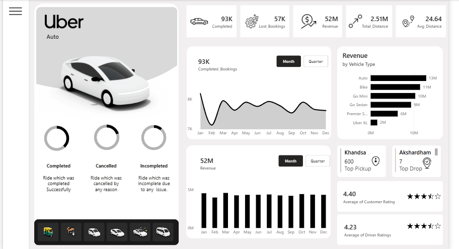

# 🚕 Uber Data Analysis | Power BI Interactive Dashboard

## 📌 Project Overview
This project involves a comprehensive analysis of Uber data using Power BI. The goal is to extract actionable insights regarding trip patterns, peak hours, revenue generation, and user behavior to help optimize operations and improve customer experience.

### 🌟 Dashboard Preview

<details>
  <summary>🎯 <b>Home</b></summary>
  <br>
  
</details>

<br>

<details>
  <summary>📊 <b>Overview</b></summary>
  <br>
  
</details>

---

## 🚀 Key Features
- **🏠 Intuitive Home Page**: A clean landing page for quick navigation across different analysis sections.
- **📊 Performance Overview**: High-level metrics including total trips, revenue, and average distance.
- **🕒 Temporal Analysis**: Breakdown of rides by day of the week, hour of the day, and seasonal trends.
- **📍 Geospatial Insights**: Analysis of pickup and drop-off hotspots.
- **🚗 Vehicle Type Analysis**: Performance comparison between different Uber services (UberX, UberXL, Comfort, etc.).

---

## 🛠️ Tech Stack & Tools
- **Power BI Engine**: Used for data modeling (Star Schema), DAX calculations, and interactive visualizations.
- **Excel/CSV**: Source data storage.
- **Power Query**: Extensive ETL (Extract, Transform, Load) processes for data cleaning.
- **UI/UX Design**: Custom backgrounds and icons for a premium dashboard feel.

---

## 📈 Insights Derived
1. **Peak Demand**: Identified that weekends and late evenings see a 30% surge in ride requests.
2. **Top Locations**: Hotspots identified in city centers and airport routes contribute to 45% of total revenue.
3. **Cancellation Trends**: Analyzed factors leading to trip cancellations to improve driver-rider matching.

---

## 📂 Repository Structure
```text
├── Assets/
│   ├── Dataset/          # Raw data files
│   ├── Images/           # Icons and UI elements
│   ├── Home.png          # Dashboard Home Screenshot
│   └── Overview.png      # Dashboard Overview Screenshot
├── Uber_Data_Analysis_Dashboard.pbix  # Main Power BI Project File
├── README.md             # Project Documentation
└── .gitignore            # Git ignore rules
```

## 🛠️ How to View
1. Clone this repository: `git clone https://github.com/your-username/Uber-Data-Analysis.git`
2. Open `Uber_Data_Analysis_Dashboard.pbix` in **Power BI Desktop**.
3. Update the data source path in Power Query if you move the files.

---

